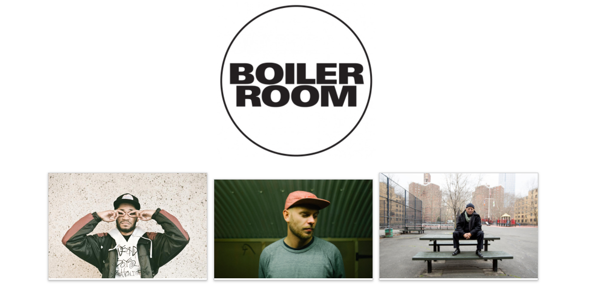
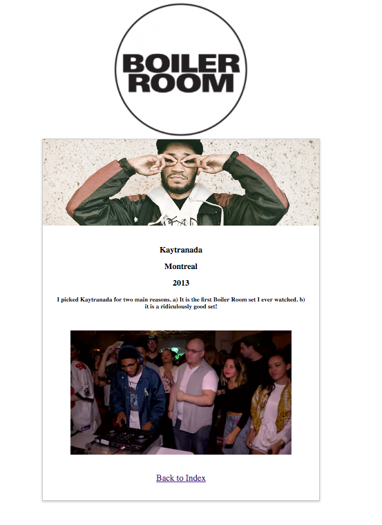

# Boiler Room

This application showcases my three favourite Boiler Room sets.

## The Challenge

Build a simple node server and React OR React Native application that displays information about your three favourite Boiler Room sets in a web page OR mobile application. You don't need to use a database (just use static javascript objects in your server side code), but you should make a network request to your node server to fetch information about the sets (including but not limited to title, artist, and location), and then display them in a simple list.

What we are looking for
- Clear and legible code
- It should be easy for us to run your project
- A well documented README

## How to Run

#### 1) Install Node

This cracking installation needs Node.
In your terminal run:
```
$ brew install node
```

#### 2) Clone this repository
```
$  cd desired/file/location/of/Boiler-Room
$  git clone git@github.com:jackbittiner/Boiler-Room.git
```

#### 3) Download Required Node Packages
This uses node package manager ('npm') and it is installed at the same time as node.
```
$  cd file/location/of/Boiler-Room
$  npm install
```

#### 4) Run
Because we're using JSX syntax, we need to babel-node to run the programme. In order to do so type the following into the Command Line:
```
NODE_ENV=production node_modules/.bin/babel-node --presets react,es2015 src/server.js
```

#### 5) Enjoy the Minimalism of the HomePage...



#### 6) Click on One of the Artists
This is what you'll be taken to.



Enjoy the sets!
